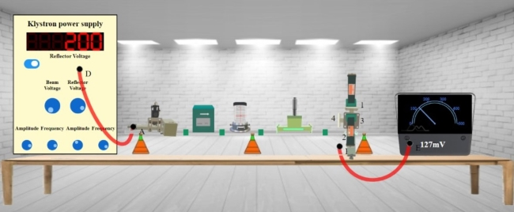
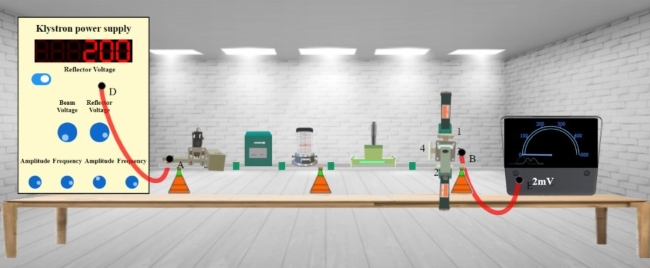
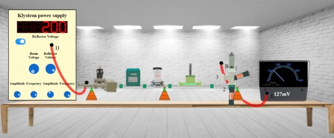
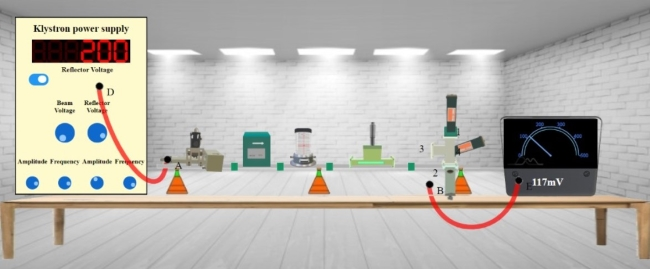
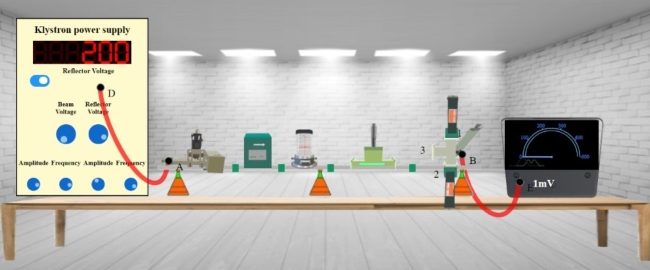

### Steps to perform experiment
 
  
**Step 1:** The aim of this experiment is to get familiarized with the electrical devices.  
**Step 2:** Click on <b>‘Next’</b> Button to view the next electrical device. 
**Step 3:** Click on <b>‘Previous’</b> button to go back to previous electrical device. 
**Step 4:** Repeat <b> Step 2 and 3</b> until you reach the end of the experiment. 

 

### Instructions to Record the Value for Output Voltage at port 1 of H-plane Tee

**Step-1:** Click on Components button for components to pop up.  
**Step-2:** Click on the "Components", drag them to the test bench and place them as shown in fig. 4.  
  

**Fig. 4 Setup for recording the value for output voltage at port 1 of H-plane Tee**

 
**Step-3:** After placing the components on the test bench, connect the wires accordingly.  
**Step-4:** If your connections are correct then you may continue to take down the readings, if not then click on "Reset Button" and try it again.  
**Step-5:** Toggle the switch button and note down the value for output voltage at port 1 from millivoltmeter.  
**Step-6:** Click on "Add to table" button to record the readings for output voltage at port 1 of H-plane Tee.  
**Step-7:** Click on "Next" button to check output voltage at port 2.
 

### Instructions to Record the Value for Output Voltage at port 2 of H-plane Tee

**Step-1:** Click on Components button for components to pop up.  
**Step-2:** Click on the "Components", drag them to the test bench and place them as shown in fig. 5.  
  

**Fig. 5 Setup for recording the value for output voltage at port 2 of H-plane Tee**

  
**Step-3:** After placing the components on the test bench, connect the wires accordingly.  
**Step-4:** If your connections are correct then you may continue to take down the readings, if not then click on "Reset Button" and try it again.  
**Step-5:** Toggle the switch button and note down the value for output voltage at port 2 from millivoltmeter.  
**Step-6:** Click on "Add to table" button to record the readings for output voltage at port 2 of H-plane Tee.  
**Step-7:** Click on "Magic Tee" button to check its basic properties.

### Instructions to Record the Value for Output Voltage at port 1 of Magic Tee when Input is at Port 4

**Step-1:** Click on Components button for components to pop up.  
**Step-2:** Click on the "Components", drag them to the test bench and place them as shown in fig. 6.  
  

**Fig. 6 Setup for recording the value for output voltage at port 1 of Magic Tee when input is at port 4**

  
**Step-3:** After placing the components on the test bench, connect the wires accordingly.  
**Step-4:** If your connections are correct then you may continue to take down the readings, if not then click on "Reset Button" and try it again.  
**Step-5:** Toggle the switch button and note down the value for output voltage at port 1 from millivoltmeter.  
**Step-6:** Click on "Add to table" button to record the readings for output voltage at port 1 of Magic Tee.  
**Step-7:** Click on "Next" button to check output voltage at port 2.

 

### Instructions to Record the Value for Output Voltage at port 2 of Magic Tee when Input is at Port 4

**Step-1:** Click on Components button for components to pop up.  
**Step-2:** Click on the "Components", drag them to the test bench and place them as shown in fig. 7.  

**Fig. 7 Setup for recording the value for output voltage at port 2 of Magic Tee when input is at port 4**

**Step-3:** After placing the components on the test bench, connect the wires accordingly.  
**Step-4:** If your connections are correct then you may continue to take down the readings, if not then click on "Reset Button" and try it again.  
**Step-5:** Toggle the switch button and note down the value for output voltage at port 2 from millivoltmeter.  
**Step-6:** Click on "Add to table" button to record the readings for output voltage at port 2 of Magic Tee.  
**Step-7:** Click on "Next" button to check output voltage at port 3.

### Instructions to Record the Value for Output Voltage at port 3 of Magic Tee when Input is at Port 4

**Step-1:** Click on Components button for components to pop up.  
**Step-2:** Click on the "Components", drag them to the test bench and place them as shown in fig. 8.  
  

**Fig. 8 Setup for recording the value for output voltage at port 3 of Magic Tee when input is at port 4**

  

**Step-3:** After placing the components on the test bench, connect the wires accordingly.  
**Step-4:** If your connections are correct then you may continue to take down the readings, if not then click on "Reset Button" and try it again.  
**Step-5:** Toggle the switch button and note down the value for output voltage at port 3 from millivoltmeter.  
**Step-6:** Click on "Add to table" button to record the readings for output voltage at port 3 of Magic Tee.  
**Step-7:** Click on "Next" button to check output voltage at port 1 when input is at port 3.
 

### Instructions to Record the Value for Output Voltage at port 1 of Magic Tee when Input is at Port 3

**Step-1:** Click on Components button for components to pop up.  
**Step-2:** Click on the "Components", drag them to the test bench and place them as shown in fig. 9.  
  

**Fig. 9 Setup for recording the value for output voltage at port 1 of Magic Tee when input is at port 3**

**Step-3:** After placing the components on the test bench, connect the wires accordingly.  
**Step-4:** If your connections are correct then you may continue to take down the readings, if not then click on "Reset Button" and try it again.  
**Step-5:** Toggle the switch button and note down the value for output voltage at port 1 from millivoltmeter.  
**Step-6:** Click on "Add to table" button to record the readings for output voltage at port 1 of Magic Tee.  
**Step-7:** Click on "Next" button to check output voltage at port 2.

### Instructions to Record the Value for Output Voltage at port 2 of Magic Tee when Input is at Port 3

**Step-1:** Click on Components button for components to pop up.  
**Step-2:** Click on the "Components", drag them to the test bench and place them as shown in fig. 10.  
  

**Fig. 10 Setup for recording the value for output voltage at port 2 of Magic Tee when input is at port 3**

**Step-3:** After placing the components on the test bench, connect the wires accordingly.  
**Step-4:** If your connections are correct then you may continue to take down the readings, if not then click on "Reset Button" and try it again.  
**Step-5:** Toggle the switch button and note down the value for output voltage at port 2 from millivoltmeter.  
**Step-6:** Click on "Add to table" button to record the readings for output voltage at port 2 of Magic Tee.  
**Step-7:** Click on "Next" button to check output voltage at port 4.

### Instructions to Record the Value for Output Voltage at port 4 of Magic Tee when Input is at Port 3

**Step-1:** Click on Components button for components to pop up.  
**Step-2:** Click on the "Components", drag them to the test bench and place them as shown in fig. 11.  
  

**Fig. 11 Setup for recording the value for output voltage at port 4 of Magic Tee when input is at port 3**

**Step-3:** After placing the components on the test bench, connect the wires accordingly.  
**Step-4:** If your connections are correct then you may continue to take down the readings, if not then click on "Reset Button" and try it again.  
**Step-5:** Toggle the switch button and note down the value for output voltage at port 4 from millivoltmeter.  
**Step-6:** Click on "Add to table" button to record the readings for output voltage at port 4 of Magic Tee.  
**Step-7:** Click on "Print" button to get all the readings.

