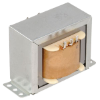
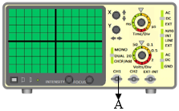

<<<<<<< HEAD

1. Click on the **Component** button to place components on the breadboard.

&emsp; &emsp; &emsp; &emsp; &emsp; &emsp; &emsp;  &emsp;  

**Fig. 1 Components** 

  
  

**Fig. 2 Circuit diagram of power supply**

2. Make connections as per the table given below.

**Table 1: Connection table**

 

  
3. Click on **Check Connection** button. If connections are right, click on **‘OK’**, then **Simulation** will become active.
4. Observe capacitor filter and DC waveform on C.R.O by adjusting C.R.O channel **CH1/CH2** and **TIME** knobs.
5. Use **X** Shift and **Y** Shift knobs for wave shifting.
6. Click on the **Reset** button to reset the webpage.
=======
## Procedure 

To perform the experiment:  
  
1.  Connect the circuit as shown in the figure 1 using LED.
2.  Apply the supply voltage from DC regulated power supply (Vin) from 0V to 10V.
3.  Tabulate the readings by measuring the the voltage (Vf) across the diode and current (If) through the diode for diffrent steps of applied voltage (Vin).
4.  Plot a graph between the voltage across the diode (Vf) and current passing through the diode (If).
<!-- 5.  Draw the graph between Forward Voltage (Vf) and Forward Current (If).-->  

  

**Figure 1: Set up for Characterisation of LED**

>>>>>>> ed1751d49c27b6c065ea521a059d4c7f775e9dd5

