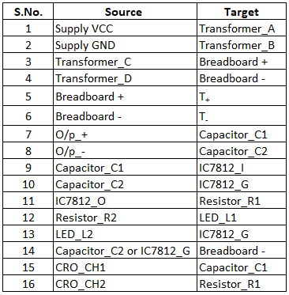

## Procedure 

**1.** Fill the truth table and click on Check button.   
**2.** Click on the components button to place the component on the table.  

  
&emsp; &emsp; &emsp; &emsp;&emsp; &emsp; &emsp;  &emsp; &emsp;   

**Fig. 1: Components**  

**3.** Make connections as per the circuit diagram or connection table.

**Fig. 2: Circuit diagram of bistable multivibrator.**

**Table 1: Connection table of bistable multivibrator**

**4.** Once the connections are made, click on '**Check Connections**' button. If connections are right, the '**Start Simulation**' button will become active. Click on it to start the simulation.  
**5.** Click on **'Set'** and **'Reset'** tactile buttons to provide inputs to the circuit.

