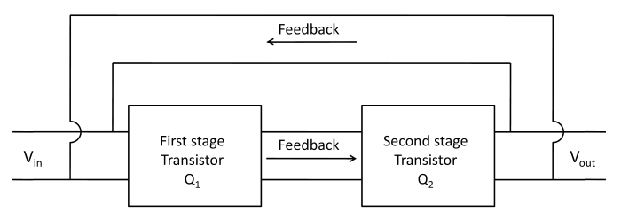
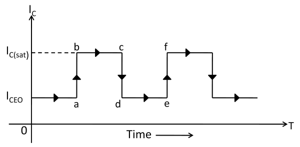
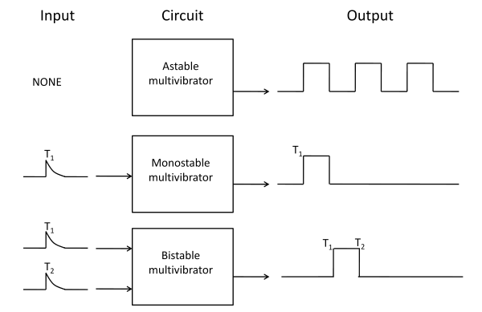
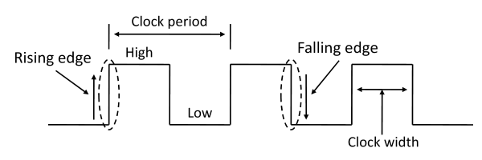
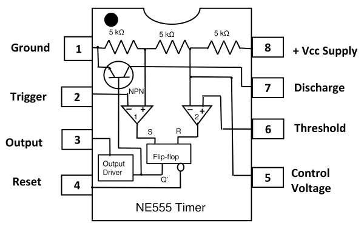
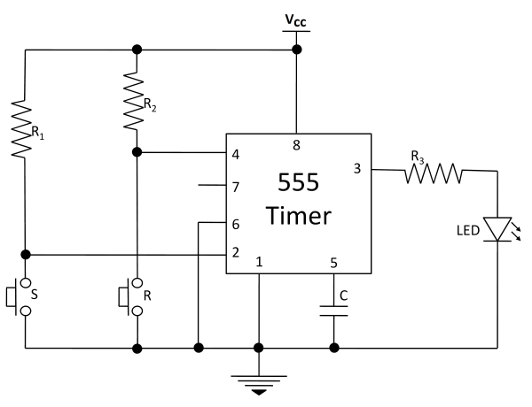

### Introduction

#### **Multivibrator**

An electronic circuit that generates square waves or other non-sinusoidal waves such as rectangular, saw-tooth waves is known as multivibrator. A multivibrator is a switching circuit which depends on positive fedback. It is basically two stage amplifier with output of one feedback to the input of other as shown in figure 1. The circuit operates in two states (viz ON and OFF) controlled by circuit conditions .Each amplifier stage supplies feedback to the other in such a manner that will drive the transistor of one stage to saturation (ON state) and the other to cut off (OFF state).  

**Fig.1- Block diagram of multivibrator**

After a certain time controlled by circuit conditions, the action is reserved i.e. saturated stage is driven to cut off and the cutoff stage is driven to saturation. The output can be taken across either stage and may be rectangular or square wave depending upon the circuit conditions. Fig. 1 shows the block diagram of a multivibrator. It is a two stage amplifier with 100% positive feedback. Suppose output is taken across the transistor Q2. At any particular instant, one transistor is ON and conducts Ic(sat) while the other is OFF. Suppose Q2 is ON and Q1 is OFF. The collector current in Q2 will be Ic(sat) as shown in figure 2. This condition will prevail for a time (bc in this case) determined by circuit conditions. After this time, transistor Q2 is cut off and Q1 is turned ON. The collector current in Q2 is now ICEO as shown. The circuit will stay in this condition for a time de. Again Q2 is turned ON Q1 is driven to cutoff. In this way, the output will be a square wave.

**Fig.2- Collector current with respect to time**

  

### **Types of Multivibrator**

A multivibrator is basically a two-stage amplifier with output of one feedback to the input of the other. At any particular instant, one transistor is ON and other is OFF. After a certain time depending upon the circuit components, the stages reverse their conditions- the conducting stage suddenly cuts off and non-conducting stage suddenly starts to conduct. The two possible states of a multivibrator are -

||**ON**|**OFF**|
|--|--|--|
|**First State**|Transistor 1|Transistor 2|
|**Second State**|Transistor 2|Transistor 1|

  

### Types of Multivibrator

It is a circuit designed to have zero, one, or two stable output states. A multivibrator circuit oscillates between a “HIGH” state and a “LOW” state producing a continuous output. There are three types of multivibrators.

Depending upon the manner in which the two stages interchange their states, the multivibrators are classified as :

(i) Astable or Free-Running Multivibrators  
(ii) Monostable or One-Shot Multivibrator  
(iii) Bistable Multivibrator or Flip- Flop

Fig. 3 shows the input /output relations for the three types of multivibrators.

**Fig.3- Input and output waveforms of multivibrator**

  

### (i)Astable multivibrator

The astable multivibrator alternates automatically between the two states and remain in each for a time dependent upon the circuit constants. Thus it is just an oscillator since it requires no external pulse for its operation. Of course, it does require a source of d.c. power. Because it continuously produces the square wave output, it is often referred to as a free running multivibrator.

### (ii)Monostable multivibrator

The monostable multivibrator has one state stable and one quasi-stable state. The application of input pulse triggers the circuit into its quasi-stable state, in which it remains for a period determined by circuit constants. After this period of time, the circuit returns to its initial stable state, the process is repeated upon the application of each trigger pulse. Since the monostable multivibrator produces a single output pulse for each input trigger pulse, it is generally called one-shot multivibrator.

### (iii)Bistable multivibrator

The bistable multivibrator has both the two states stable. It requires the application of an external triggering pulse to change the operation from either one state to other. Thus one pulse is used to generate half-cycle of square wave and another pulse to generate the next half-cycle of square wave. It is also known as flip-flop multivibrator because of the two possible states it can assume.

  

Individual Sequential Logic circuits can be used to build more complex circuits such as Multivibrators, Counters, Shift Registers, Latches and Memories etc, but for these types of circuits to operate in a “sequential” way, they require the addition of a clock pulse or timing signal to cause them to change their state. Clock pulses are generally continuous square or rectangular shaped waveform that is produced by a single clock pulse generation circuits can be a combination of analogue and digital circuits that produce a continuous series of pulses (these are called astable multivibrators) or a pulse of a specific duration (these are called monostable multivibrators). Combining two or more of multivibrators provides generation of a desired pattern of pulses (including pulse width, time between pulses and frequency of pulses). Sequential Logic Circuits that use the clock signal for synchronization are dependent upon the frequency and clock pulse width to activate there switching action. Sequential circuits may also change their state on either the rising or falling edge, or both of the actual clock-signal as we have seen previously with the basic flip-flop circuits. The following terms are associated with a timing pulse or waveform.

**Fig.4- Clock Signal Waveform**

**Active HIGH**  
If the state change occurs from a “LOW” to a “HIGH” at the clock’s pulse rising edge or during the clock width.

**Active LOW**  
If the state change occurs from a “HIGH” to a “LOW” at the clock’s pulse falling edge.

**Duty Cycle**  
This is the ratio of the clock width to the clock period.

**Clock Width**  
This is the time during which the value of the clock signal is equal to logic “1”, or HIGH.

**Clock Period**  
This is the time between successive transitions in the same direction i.e. between two rising or two falling edges.

**Clock Frequency**  
The clock frequency is the reciprocal of the clock period  

**Frequency = 1/clock period** 

  
Multivibrators can be easily constructed from discrete components to produce relaxation oscillators for generating basic square wave output waveforms. But there are also dedicated IC’s especially designed to accurately produce the required output waveform with the addition of just a few extra timing components. One such device that has been around since the early days of IC’s and has itself become something of an industry “standard” is the **555 Timer Oscillators** which is more commonly called the **“555 Timer”**. The **555 timer** name comes from the fact that there are three 5 KΩ resistors connected together internally producing a voltage divider network between the supply voltage and ground. Pin diagram including the internal circuitry of the 555 Timer is shown in figure 5.  

**Fig.5- Pin Diagram of the 555 Timer IC**

### Pin configuration of 555 timer IC

**Pin 1: Ground:** The ground pin connects the 555 timer to the 0V supply.  
**Pin 2: Trigger Terminal:** The trigger pin is used to feed the trigger input  
**Pin 3: Output Terminal:** Output of the timer is available at this pin.  
**Pin 4: Reset Terminal:** Whenever the timer IC is to be reset or disabled, a negative pulse is applied to pin 4, and thus is named as reset terminal.  
**Pin 5: Control Voltage Terminal:** The threshold and trigger levels are controlled using this pin.  
**Pin 6: Threshold Terminal:** This is the non-inverting input terminal of comparator 1, which compares the voltage applied to the terminal with a reference voltage of 2/3 VCC .  
**Pin 7: Discharge Terminal:** This pin is connected internally to the collector of transistor and mostly a capacitor is connected between this terminal and ground. It is called discharge terminal  
**Pin 8: Supply Terminal:** A supply voltage of + 5 V to + 18 V is applied to this terminal with respect to ground (pin 1).  

### Timer 555 as Bistable Multivibrator

A bistable multivibrator is one of the easiest circuits that can be built using a 555 timer as shown in figure 6. It doesn’t require a capacitor as the RC charging unit is not responsible for the generation of the output. The generation of high and low outputs is independent and is controlled by the external trigger and reset signals.

**Fig.6- Circuit diagram for Bistable Multivibrator using the 555 Timer IC** 

  
The explanation of the bistable mode of operation of the 555 timer is as follows:  
The trigger and reset pins (pins 2 and 4 respectively) are connected to the supply through two resistors R1 and R2 so that they are always high. Pin 6 is grounded so that comparator (comparator 2, figure: 5) remains at low state. Two switches are connected between pin 2 and pin 4, and ground in order to make them go low momentarily. The switch at the trigger input will act as S (SET) input for the internal flip-flop. The switch at the reset input will act as reset for the internal flip-flop. When the switch ‘S’ is pressed, the voltage from VCC will bypass the trigger terminal and is shorted to ground through the resistor R1. Hence, the trigger pulse will momentarily go low forcing the connected internal comparator (comparator 1, figure: 5) to produce high output and the output of the timer at pin 3 will become HIGH. The output stays HIGH because there is no input from the threshold pin (pin 6) and the output of the internal comparator (comparator 2) will not go high.

When the switch ‘R’ is pressed, the voltage from VCC will bypass the reset terminal and is shorted to ground through the resistor R2. This pin is internally connected to the RESET terminal of the flip-flop. When this signal goes low for a moment, the flip-flop receives the reset signal and RESETs the flip-flop. Hence, the output will become LOW and stays there until the trigger ‘S’ is applied.

