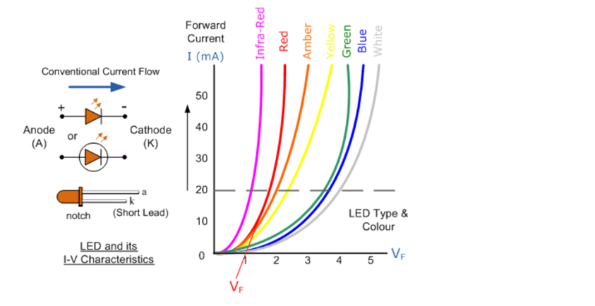

### Introduction

A Light Emitting Diode (LED) is a semiconductor diode that emits light when an electric current is applied in forward direction of the device as in simple LED circuit. The effect is a form of electroluminescence where incoherent and narrow-spectrum light is emitted from the p-n junction.

  

For optical communication systems requiring bit rates less than approximately 100-200 Mb/s together with multimode fiber-coupled optical power in tens of microwatts, semiconductor light-emitting diodes (LEDs) are usually the best light source choice. LEDs require less complex drive circuitry than laser diodes since no thermal or optical stabilization circuits are needed and they can be fabricated less expensively with higher yields.

  

To be useful in fiber transmission applications and LED must have a high radiance output, a fast emission response time and high quantum efficiency. To achieve a high radiance and a high quantum efficiency, the LED structure must provide a means of confining the charge carriers and the stimulated optical emission to the active region of the pn junction where radiative recombination takes place.

The two basic LED configurations being used for fiber optics are surface emitters and edge emitters.

  
  
  

**Figure 1: Light Emitting Diodes I-V Characteristics**

  
  

**Figure 2: Set up for Characterisation of LED**

